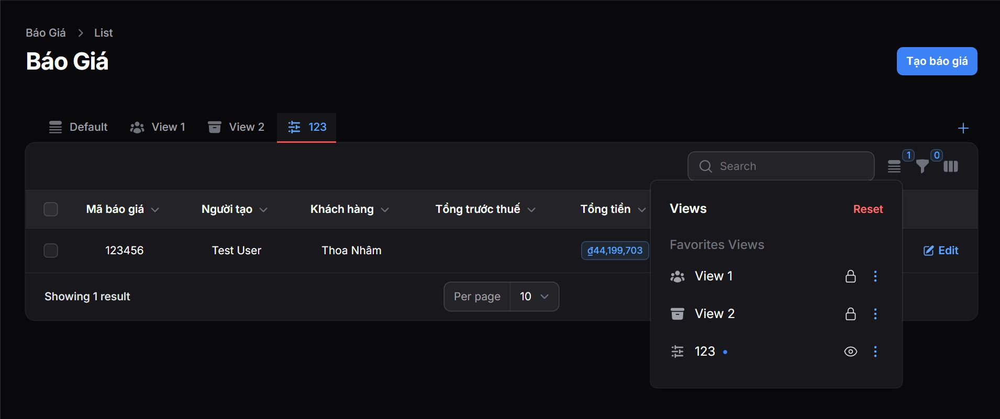

# Table Views for Laravel Filament

A powerful package for managing table views in Laravel Filament applications.

> This package is originally developed by [AureusERP](https://github.com/aureuserp/aureuserp) and modified for standalone usage.

## Live Demo

You can experience the Table Views module in action on the official AureusERP demo site:

- [AureusERP Demo](https://demo.aureuserp.com/)

## Screenshots



## Features

- Create and manage custom table views
- Save favorite views
- Public and private views
- Custom filters and sorting
- User-specific views
- Easy integration with Filament

## Requirements

- PHP 8.1 or higher
- Laravel 10.0 or higher
- Filament 3.0 or higher

## Installation

You can install the package via composer:

```bash
composer require kozsuper/filament-table-views
```

Publish the migrations:

```bash
php artisan vendor:publish --tag=table-views-migrations
```

## Usage
1. Run migrations:

```bash
php artisan migrate
```

2. Use the trait in your Filament resources:

```php
use KozSuper\TableViews\Filament\Concerns\HasTableViews;

class YourResource extends Resource
{
    use HasTableViews;
    
    // Your resource code...
}
```

## Configuration

You can publish the config file with:

```bash
php artisan vendor:publish --provider="KozSuper\TableViews\TableViewsServiceProvider" --tag="config"
```

## License

This package is open-sourced software licensed under the [MIT License](LICENSE.md).

### Attribution

This package is based on the Table Views module from [AureusERP](https://github.com/aureuserp/aureuserp), which is also licensed under the MIT License.